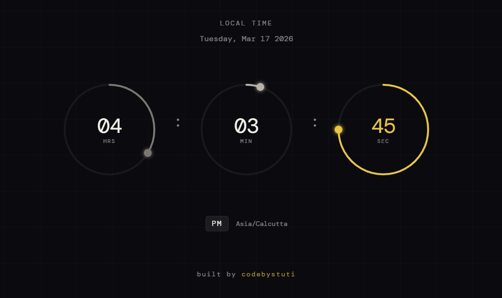

# circular-clock

Three animated SVG rings showing hours, minutes and seconds — each with an orbiting dot that tracks the arc tip in real time.

**[Live Demo](https://codebystuti.github.io/circular-clock)**

---



---

## How it works

**Arcs** use the SVG `stroke-dashoffset` technique — each ring has a stroke equal to its full circumference (`2πr ≈ 440`). Reducing the offset progressively reveals the arc, so 30 seconds shows exactly half the ring filled.

**Orbiting dots** are positioned using circle geometry. Each second the dot's `cx` and `cy` attributes are recalculated:
```
angle = (fraction × 2π) − π/2
cx = centerX + radius × cos(angle)
cy = centerY + radius × sin(angle)
```
The `−π/2` shifts the start point to 12 o'clock instead of 3 o'clock.

**Reset** — when a unit rolls over to zero, the CSS transition is cut for one frame using `requestAnimationFrame` so the arc snaps back instantly rather than animating backwards.

**Date and timezone** are detected automatically — `toLocaleDateString` for the date, `Intl.DateTimeFormat().resolvedOptions().timeZone` for the timezone string.

## Design

Single amber accent (`#e8c547`) on the seconds ring only — hours and minutes use warm muted greys at different opacities. The focal point shifts as the seconds move, everything else supports it.

## Stack

Pure HTML, CSS and JavaScript — no libraries, no build tools.

---

*codebystuti*
